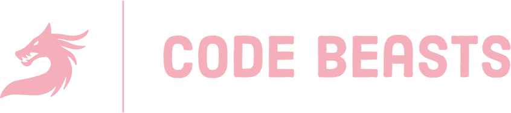

# To-Do Beast List 🐉📋

## To-Do:
1. #### What is this project about?
  - This **2 week long** project is aimed at implementing our knowledge of `JavaScript` 📋, `DOM Manipulation`📄 as well as `React.js`⚛️ into practice
2. #### I want to find out more info about the project!
  - The latest deployed version of the project is always available [right here!🔗](https://mochibunn.github.io/ToDoBeastList "Deployed version of the project")
  - The **Trello**📋 board is available [here🔗](https://trello.com/b/R5qfJ15W/code-beasts "Project's Trello board")
  - The wireframe🌐 is so simple, it's just a screenshot📸 available [right here!🔗](https://cdn.discordapp.com/attachments/199274450011553792/1150808990276653096/image.png "Screenshot of the project wireframe")
  - To view the developer commentary showcase, please visit [this link🔗](https://go.mochibun.me/qziRlT "Documentation")
3. #### I spy with my little eye something white
  - *TODO: Find out what that might be* 🔎

 

